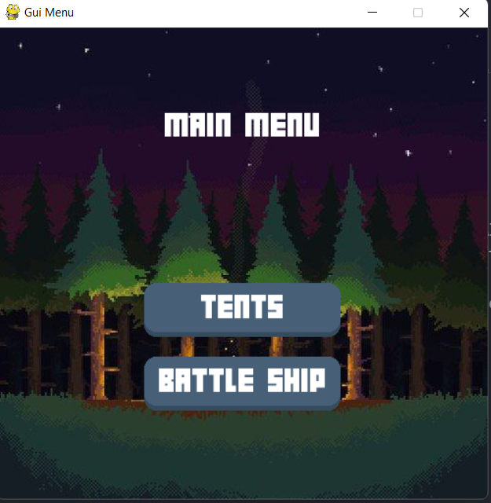
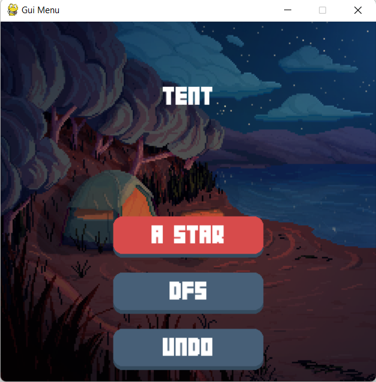
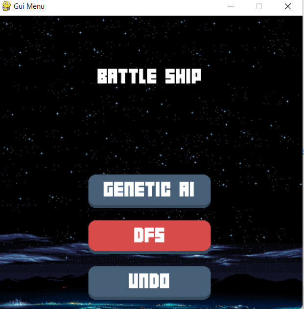
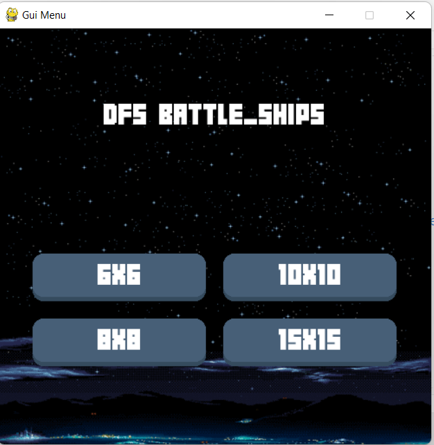
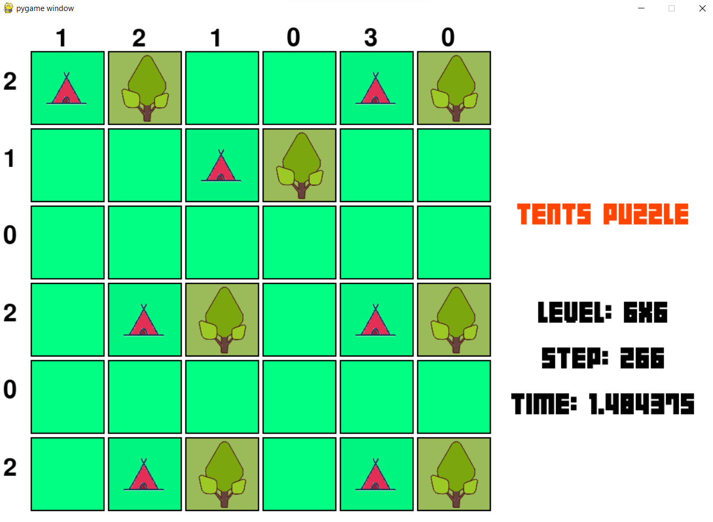
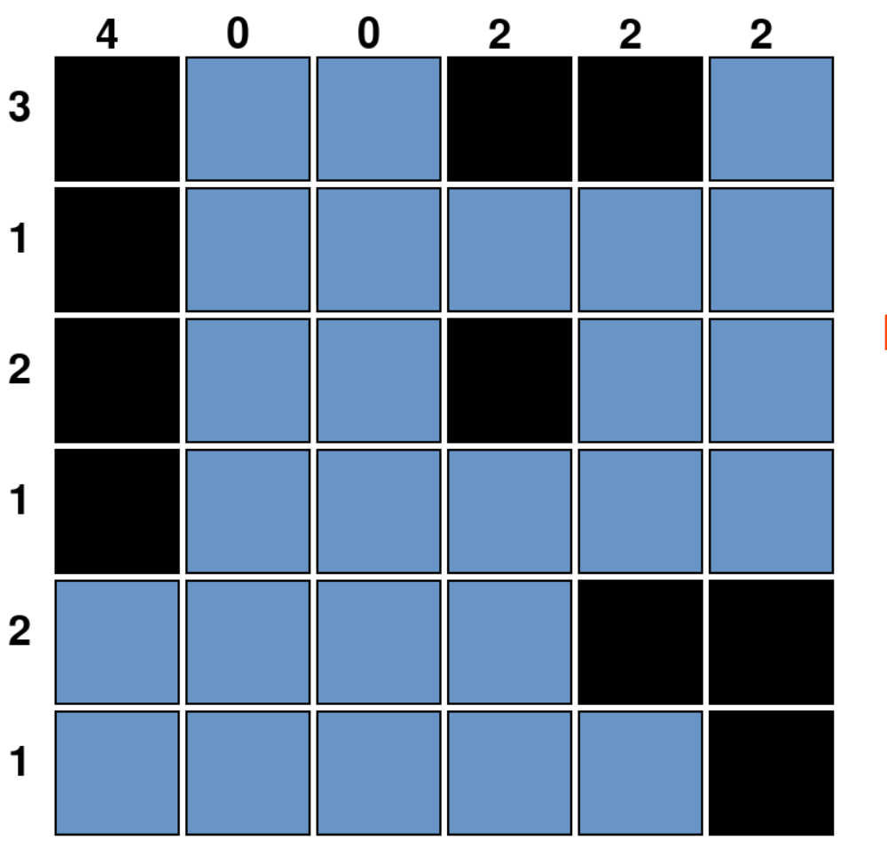

# Introduction-to-Artificial-Intelligence---CO3061
**Run GUI**
Run GUI_start.py.

**Select the game you want to watch**

Tents puzzle or Battleships

**Select the algorithm you want to watch**

Tents puzzle:

*A* algorithm

*DFS (Depth first search) algorithm

Battleships puzzle:
*Genetic algorithm
*DFS (Depth first search) algorithm

**Select the level**

**Rule of Tents Game**
*Each tent is placed adjacent to a single tree.
*The number of tents must equal to the number of trees.
*Around each tent, there must be no other tents.
*The number of tents placed in each row and column must equal to the constraint of this row and column respectively.

**Rule of Battleships**
*Finding the number of battleships according to the requirement of amount and size
*Around each battleship, there must be no other battleships.
*The number of block of these battleships placed in each row and column must equal to the constraint of this row and column respectively.

**GUI of Tents puzzle**

**GUI of Battleships puzzle**

**Run to measure**
Run script_battleship.py -> file result in: "csv/result_battleship.csv".
Run script_tent.py -> file result in : "csv/result_tent.csv".

**View csv result**
Run test_pandas.py in csv folder.

