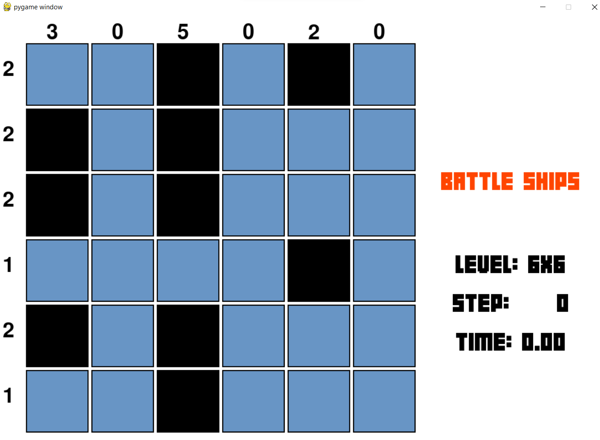

# Introduction-to-Artificial-Intelligence---CO3061
**Run GUI**
Run GUI_start.py.

**GUI of Tents puzzle**

**GUI of Battleships puzzle**

**Run to measure**
Run script_battleship.py -> file result in: "csv/result_battleship.csv".
Run script_tent.py -> file result in : "csv/result_tent.csv".

**View csv result**
Run test_pandas.py in csv folder.

